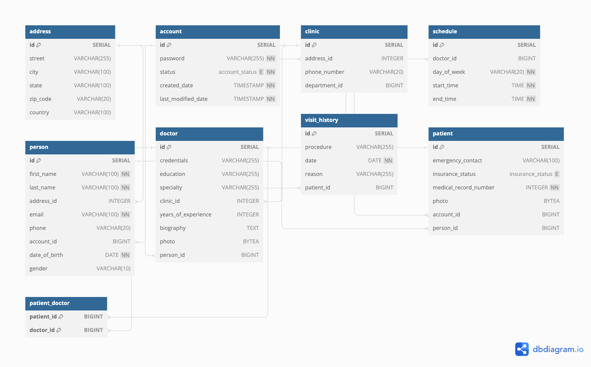

# general-hospital-system #
Office administrative tool for General Hospital

General Hospital Management System - README

Overview

The General Hospital Management System is a comprehensive solution designed to streamline healthcare facility operations. It integrates various functionalities to manage appointments, patient records, billing, and communications efficiently. This document outlines the system requirements and functionalities to ensure the software meets the needs of healthcare providers and patients.

 ### System Architecture

	•	Frontend: Angular
	•	Backend: Spring Boot Cloud
	•	Containerization: Docker
	•	Orchestration: Kubernetes

System Requirements

Hardware Requirements

	•	Processor: Intel Core i5 or higher
	•	Memory: 8 GB RAM minimum
	•	Hard Disk: 500 GB HDD or more
	•	Display: 1080p resolution

Software Requirements

	•	Operating System: Windows 10 and above, MacOS Mojave (10.14) and above, or a modern Linux distribution
	•	Database: PostgreSQL 12.0 or higher, Oracle 12c or higher
	•	Web Server: Apache 2.4 or higher, Nginx 1.18 or higher
	•	Browser: Latest versions of Google Chrome, Firefox, Safari, or Edge

Functionalities

Multi-Language Support

	•	Supports multiple languages to cater to non-English speaking patients and staff.

Appointment Management

	•	Supports viewing multiple departments and doctors.
	•	Customizable appointment reminders via SMS, email, or phone call.
	•	Automatic scheduling conflict alerts and resolution suggestions.
	•	Real-time updates on doctors’ schedules and available slots.

Patient Management

	•	Unique identification for each patient with comprehensive profile management.
	•	Advanced search filters and interoperability with external healthcare systems.
	•	Document management for storing and sharing important patient documents.

Billing and Payments

	•	Integration with multiple payment gateways and detailed breakdown of operation fees.
	•	Supports payments from insurance providers, cash, or co-pay.
	•	Real-time updates on insurance cover and deductible status.

Notifications and Communications

	•	Automated notifications for upcoming appointments and check-in statuses.
	•	Internal messaging system for office personnel communication.

Reporting and Analytics

	•	Real-time analytics on clinic operations including patient flow, wait times, and financial metrics.

Emergency and Security

	•	Management of emergency contact information and medical alerts.
	•	Customizable user roles and permissions to ensure data security and privacy.

Additional Features

	•	Scheduling surgeries at other facilities and managing room inventory.
	•	Patient feedback mechanism to improve service quality.
	•	Cancellation of appointments with optional reasons.

Deployment

The application leverages Docker for containerization and Kubernetes for orchestration, ensuring scalable and resilient deployment across different environments.

Installation Steps

	1.	Ensure all hardware and software prerequisites are met.
	2.	Install Docker and set up Kubernetes cluster.
	3.	Build Docker images for the Angular frontend and Spring Boot backend.
	4.	Deploy the application using Kubernetes manifests.
	5.	Configure ingress controllers and service discovery as required.
	6.	Access the application through the configured external IP or domain name.
